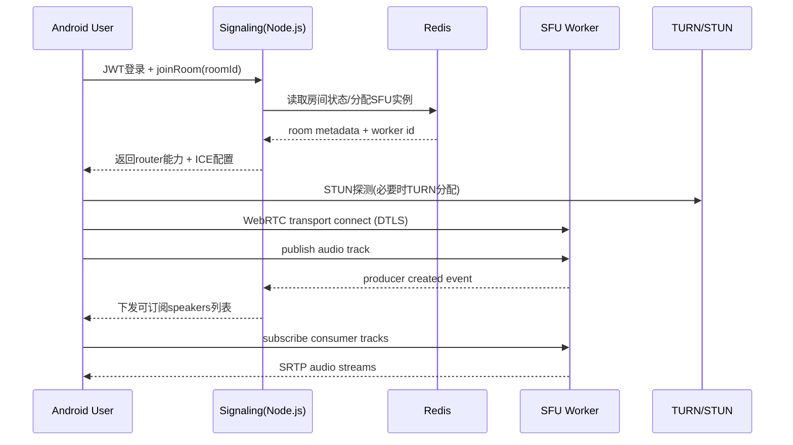

# ARCHITECTURE.md v0.6 - Android(Kotlin WebRTC)+Node.js SFU
*更新：2026-03-25 | 状态：🟢review | Tokens: 0/2M*

CHANGELOG
- v0.0 -> v0.1：初始SFU架构设计，覆盖SLA 99%与100并发<300ms目标。
- v0.1 -> v0.2：补齐`REQ-001`架构专章，冻结认证链路、Refresh安全策略、会话存储、风控限流、可观测指标、联调前检查清单与发布门禁；同步对齐`PRD`当前状态。
- v0.2 -> v0.3：对齐`PRD v0.5`与`DEMAND_ENTRANCE`口径，消除`draft/v0.4`遗留描述；在REQ-001专章补充“架构阶段已完成/未完成/发布门禁”，用于交棒`@feature_dev`开发落地。
- v0.3 -> v0.4：基于`PRD v0.7`新增REQ-001 Android验收清单做架构补漏，补齐登录后房间预览联调路径、客户端失败分支与验收映射。
- v0.4 -> v0.5：冻结`REQ-002`架构设计（订单状态机、幂等边界、扣币/落单/广播原子链路、风控与观测基线），并对齐Android验收清单A-002。
- v0.5 -> v0.6：基于`PRD v0.8`冻结`REQ-003`架构设计（SFU基线、麦位一致性、弱网降级、观测与压测口径），并对齐A-003/S-003验收清单。

## 1. 设计目标（与PRD对齐）
- 业务形态：仿Yalla多人语聊房（1个房间最多100并发在线，最多8人上麦发言）。
- 技术栈：Android 原生 Kotlin + WebRTC；Node.js（Socket.io + SFU）；PostgreSQL。
- SLA：月度可用性 >= 99.0%（信令与音频房间核心链路）。
- 实时性：端到端语音延迟 P95 < 300ms（100并发场景）。
- 可扩展：支持水平扩容，单点故障可恢复，掉线可重连。

## 2. 架构决策
- 采用 SFU（Selective Forwarding Unit）而非 MCU：减少转码开销，控制端到端延迟。
- Node.js 统一承载业务 API + Signaling + SFU Worker 编排（建议基于 mediasoup）。
- Socket.io 负责信令（鉴权、入房、上麦、订阅、重连协调），媒体走 WebRTC DTLS/SRTP。
- TURN/STUN（coturn）用于 NAT 穿透兜底，弱网环境优先走 TURN/UDP。
- Redis 用于房间状态广播与多实例会话同步；PostgreSQL 持久化用户、房间、订单等业务数据。

## 3. 模块拆分
| 模块 | 职责 | 横向扩展 | 关键指标 |
|---|---|---|---|
| Android App (Kotlin) | 登录、入房、麦位管理、WebRTC 发布/订阅、弱网自适应 | 客户端发布 | join_success_rate, reconnect_success |
| API/Signaling Gateway (Node.js + Socket.io) | JWT鉴权、房间路由、SDP/ICE信令、重连会话恢复 | 多实例 + LB + Redis Adapter | signaling_rtt_p95, auth_fail_rate |
| SFU Cluster (Node.js Worker) | 音频流转发、活跃说话人检测、订阅控制 | 按房间分片扩容 | e2e_latency_p95, packet_loss, cpu |
| TURN/STUN (coturn) | NAT穿透与中继 | 多节点 | turn_allocations, relay_ratio |
| Redis | 房间元数据/事件总线/分布式会话锁 | 主从 + 哨兵/托管版 | redis_latency, failover_time |
| PostgreSQL | 用户、房间、订单、审计日志 | 读写分离（后续） | qps, slow_query, replication_lag |

## 4. 总体拓扑图（Mermaid）
```mermaid
flowchart LR
    A["Android Clients (1..100)"] -->|HTTPS/JWT| B["API + Signaling Gateway (Node.js)"]
    A -->|WebRTC SDP/ICE| B
    A -->|SRTP Audio (Pub/Sub)| C["SFU Cluster (Node.js/mediasoup)"]
    B --> D["Redis (Room State + PubSub)"]
    B --> E["PostgreSQL (User/Room/Order)"]
    B --> F["Load Balancer"]
    F --> B
    A --> G["STUN/TURN (coturn)"]
    G --> C
    C --> D
```

## 5. 关键时序（入房+开麦）


## 6. 延迟预算（P95）
| 链路环节 | 预算 |
|---|---|
| 采集+编码（客户端） | 35ms |
| 上行网络（Client->SFU） | 70ms |
| SFU排队+转发 | 25ms |
| 下行网络（SFU->Client） | 90ms |
| 抖动缓冲+解码+播放 | 60ms |
| **总计** | **280ms** |

说明：预算总量 280ms，为 300ms 目标预留约 20ms 波动空间。

## 7. 高可用与SLA 99%
- LB + 多实例 Gateway：任一网关故障不影响全局服务，健康检查秒级摘除。
- SFU 分片部署：房间固定到 SFU Worker，异常时触发房间级重建与客户端自动重连。
- Redis 保障跨实例会话同步：避免“信令实例切换导致房间状态丢失”。
- 客户端自动恢复：断线后指数退避重连（1s/2s/4s），保留房间上下文与麦位意图。
- 错峰发布：灰度10% -> 50% -> 100%，失败可快速回滚。

## 8. 容量与性能基线（MVP）
- 100并发语聊房基线：8上麦 + 92听众。
- 默认音频编码：Opus 24-32kbps，20ms ptime，开启 DTX/FEC（弱网优先抗丢包）。
- 下行策略：默认订阅8麦位；网络劣化时降级为“活跃说话人优先（4路）”。
- 目标资源（单房间）：SFU 出口带宽建议预留 40Mbps，CPU 保持 < 65%。

## 9. 可观测性与告警
- 实时指标：room_online, speaking_users, e2e_latency_p95, jitter, packet_loss, turn_ratio。
- SLA指标：monthly_uptime, join_success_rate, reconnect_success_rate。
- 告警阈值：
  - e2e_latency_p95 > 300ms 持续 5 分钟 -> P1 告警。
  - join_success_rate < 98% 持续 10 分钟 -> P1 告警。
  - SFU CPU > 80% 持续 5 分钟 -> 自动扩容 + P2 告警。

## 10. 安全与合规（MVP最小闭环）
- API 鉴权：JWT + 短时 access token，refresh token 分离。
- 媒体链路：DTLS-SRTP 强制加密，禁止明文 RTP。
- 风控：入房频控、IP/设备维度限流、防刷礼物接口签名校验。
- 审计：关键事件（登录、入房、上麦、送礼）落库可追踪。

## 11. REQ-001 架构专章（登录 / 钱包开通）

### 11.1 当前状态与交付目标
- 当前需求状态以`docs/00-ENTRANCE/DEMAND_ENTRANCE.md`与`docs/01-PRODUCT/PRD.md (v0.8)`为准：`REQ-001`已完成开发与验收，本轮聚焦“按Android验收清单复核架构口径并补齐遗漏”，确保后续回归与版本演进不走偏。
- `OTP回退口令`、`Refresh Token明文存储`、`接口路径偏差`仍是P0安全门禁，但它们属于“实现+联调回归必须清零”的问题；本阶段（架构）交付物是冻结口径、接口契约、存储边界与门禁检查点，确保开发不会走偏。
- 架构侧本轮目标是把`REQ-001`补到“可执行联调”状态，而不是提前宣告业务通过；具体指：
  - 认证链路、状态机、失败分支、错误码与数据边界冻结；
  - `feature_dev`有明确的实现落点与存储模型；
  - `test_writer`有可执行的检查清单、观测指标与证据模板；
  - 发布门禁能够在灰度前阻断不安全实现。

#### 架构阶段已完成项（REQ-001，冻结口径）
- 接口路径冻结：仅允许`/api/v1/auth/otp/send`、`/api/v1/auth/otp/verify`、`/api/v1/auth/refresh`与`/api/v1/wallet/summary`；legacy路径统一`404/410`并上报`legacy_auth_path_hit_total`。
- 认证链路与事务边界冻结：`user upsert -> wallet bootstrap -> risk init -> refresh session insert -> commit -> issue tokens`同一事务，避免“token已签发但钱包未开”的半成功。
- Refresh安全策略冻结：强制轮转、只存`refresh_token_hash`（`SHA-256(token + server_pepper)`）、旧token重放返回`AUTH_004`、跨实例吊销传播窗口`<=60s`。
- 会话/缓存边界冻结：`auth_refresh_session`（PG权威）+ `auth:session:*`/`auth:revoke:*`（Redis热路径/吊销索引）+ 频控Key（Redis）。
- 风控与限流基线冻结：OTP发送/校验、refresh频控与命中后的统一错误码（`AUTH_002/003/004/005` + `RISK_*`）。
- 可观测与联调检查清单冻结：成功率、轮转重放、legacy路径命中、钱包开户成功率等指标与联调证据要求（见11.6/11.7）。

#### 架构阶段未完成项（待开发落地/待联调验证）
- OTP provider接入细节：联调环境配置、白名单/获取验证码方式、超时重试策略与`503 AUTH_005`统一降级提示文案（必须fail-closed，不得回退口令）。
- Android安全存储落地：refresh token写入Keystore/EncryptedSharedPreferences；access token不落盘；崩溃日志/埋点脱敏校验。
- 钱包统计字段落地：`total_spent_gold`与`spent_30d_gold`的计算口径需与`REQ-002`账务/订单模型对齐（可先返回0，但必须保留字段并保证向后兼容）。
- 灰度前门禁回归：legacy路径命中为0、日志脱敏抽检通过、refresh轮转/重放用例通过、首登重复请求不重复开户（幂等）。

#### 发布门禁（REQ-001 / PRD v0.8 P0）
- OTP provider异常必须`fail-closed`：只允许返回`503 AUTH_005`，禁止任何“回退口令/测试后门/固定验证码”。
- refresh token仅哈希存储：数据库/缓存/日志/异常栈/埋点均不得出现明文refresh token。
- legacy认证路径必须拒绝：`/api/auth/*`与`/api/v1/auth/login/otp`禁止继续返回成功体（`404/410`）。
- 刷新轮转必须生效：刷新后旧refresh token在`<=60s`内全链路不可再用；检测到旧token复用必须返回`AUTH_004`并打点。

### 11.2 认证链路（冻结方案）
- 规范路径只保留`/api/v1/auth/otp/send`、`/api/v1/auth/otp/verify`、`/api/v1/auth/refresh`三条主入口；`/api/auth/*`与`/api/v1/auth/login/otp`视为legacy路径，统一返回`404`或`410`并打观测点。
- 登录链路按“先风控、再OTP、后开户、最后签发会话”执行，OTP provider异常必须`fail-closed`，不得回退到静态口令或测试后门。
- 首登开户与风控初始化必须和会话创建共享同一数据库事务，防止出现“token已签发但钱包未开”的半成功状态。
- Android端只在本地安全存储中保留`refresh token`，`access token`仅驻留内存并在失效后通过刷新换发。

```mermaid
sequenceDiagram
    participant C as Android Client
    participant G as API Gateway
    participant RK as Risk Engine
    participant OTP as OTP Provider
    participant PG as PostgreSQL
    participant RD as Redis

    C->>G: POST /api/v1/auth/otp/send(phone, device_id, install_id)
    G->>RK: preCheck(phone, ip, device_id)
    alt 命中限流/黑名单
        RK-->>G: reject(AUTH_003 / RISK_002 / RISK_003)
        G-->>C: 429/403 + request_id
    else 通过预检
        G->>OTP: sendOtp(phone, request_id)
        alt OTP服务异常
            OTP-->>G: unavailable
            G-->>C: 503 AUTH_005 (fail-closed)
        else 发送成功
            OTP-->>G: otp_ticket + expire_at
            G-->>C: 200 otp_ticket + resend_after_sec
            C->>G: POST /api/v1/auth/otp/verify(otp_ticket, otp_code, device_id)
            G->>RK: verifyContext(phone, ip, device_id)
            G->>OTP: verifyOtp(otp_ticket, otp_code)
            alt OTP错误/过期
                OTP-->>G: invalid
                G-->>C: 400 AUTH_002
            else OTP校验通过
                G->>PG: tx(upsert user + bootstrap wallet + init risk + insert refresh_session_hash)
                G->>RD: write session cache + revoke index TTL
                G-->>C: 200 access_token + refresh_token + session_id + wallet_summary
                Note over C,G: access_token TTL=2h; refresh_token TTL=30d
                C->>G: POST /api/v1/auth/refresh(refresh_token, session_id)
                G->>PG: select refresh_session for update by hash
                alt 会话有效且未重放
                    G->>PG: revoke old session + insert rotated session
                    G->>RD: publish revoke(old_jti), cache(new_jti)
                    G-->>C: 200 new_access_token + new_refresh_token
                else 会话失效/被重放
                    G-->>C: 401 AUTH_001 / 409 AUTH_004
                end
            end
        end
    end
```

### 11.3 Token / Refresh 安全策略
| 项目 | 冻结策略 | 联调判定 |
|---|---|---|
| Access Token | TTL `2小时`；服务端统一签名算法与`kid`版本标识；禁止`alg=none`与匿名token | 篡改/过期后统一返回`AUTH_001` |
| Refresh Token | TTL `30天`；每次刷新必须轮转；客户端一次只持有最新refresh token | 刷新成功后旧token立即作废，传播窗口`<=60s` |
| Refresh存储 | 服务端只落`refresh_token_hash`，推荐`SHA-256(token + server_pepper)`；禁止日志、埋点、异常栈输出明文token | 数据库、缓存、日志抽检均不可见明文token |
| 会话绑定 | 绑定`session_id + user_id + device_id + install_id + ip_hash + ua_hash` | 设备漂移或IP异常时进入风控或强制重登 |
| 重放防护 | 刷新时对旧会话行加锁，事务内完成“旧会话吊销 + 新会话落库”；重复使用旧refresh token记为重放事件 | 返回`AUTH_004`并打`refresh_reuse_detected_total` |
| 客户端存储 | `refresh token`进入Android Keystore/EncryptedSharedPreferences；`access token`只驻留内存；登出时本地安全清除 | 抓包/日志/崩溃报告不得泄漏token |

### 11.4 会话存储与一致性边界
| 存储层 | Key / 表 | 作用 | 失效策略 |
|---|---|---|---|
| PostgreSQL | `auth_refresh_session` | 刷新会话主表，字段至少包含`session_id`、`user_id`、`refresh_token_hash`、`status`、`device_id`、`install_id`、`ip_hash`、`ua_hash`、`issued_at`、`expires_at`、`rotated_from`、`rotated_to`、`revoked_at`、`last_seen_at` | 权威数据源；过期/吊销后保留审计记录 |
| PostgreSQL | `user_wallet` + `user_risk_profile` | 首登开户、余额初始化、风险等级初始化 | 与用户创建、refresh会话插入同事务提交 |
| Redis | `auth:session:{session_id}` | 热路径缓存`uid/jti/status/expires_at`，服务于鉴权与登出传播 | TTL不长于access token；失配时回源PG |
| Redis | `auth:revoke:{jti}` | 旧refresh/access令牌吊销索引 | TTL覆盖剩余有效期，防止旧token在传播窗口内被误用 |
| Redis | `rate_limit:*` | 手机号/IP/设备维度频控计数器 | 依据限流窗口自动过期 |

- 会话状态机冻结为：`ACTIVE -> ROTATED -> REVOKED / EXPIRED`；任何非`ACTIVE`状态都不能继续刷新。
- 鉴权读取顺序：优先校验签名与TTL，再查`Redis revoke index`，最后必要时回源PG做会话状态确认。
- 首登事务边界冻结为：`user upsert -> wallet bootstrap -> risk profile init -> refresh session insert -> commit -> issue tokens`；任一步失败都不能向客户端返回成功。

### 11.5 风控与限流基线
| 场景 | 限流维度 | 基线 | 超限动作 |
|---|---|---|---|
| OTP发送 | `phone` | `1次/60秒`, `5次/10分钟` | 返回`AUTH_003`，提示冷却 |
| OTP发送 | `ip` / `device_id` | `20次/10分钟`, `10次/10分钟` | 返回`AUTH_003`并记录可疑源 |
| OTP校验 | `phone + device_id` | `5次/10分钟` | 返回`AUTH_002`；连续失败`>=3`次进入10分钟冷却 |
| Refresh | `session_id` | `10次/分钟` | 返回`AUTH_004`并标记可疑重放 |
| 登录成功后入房准备 | `uid` | `5次/分钟`拉取钱包、`10次/分钟`请求join token | 返回`429`，避免脚本刷接口 |

- 风控判定顺序：`黑名单` > `设备/IP聚类异常` > `基础频控` > `正常放行`。
- MVP阶段不引入复杂验证码升级流；一旦命中高危规则，直接阻断并产生日志、审计与客服申诉入口。
- `gift.send`链路继续沿用`REQ-002`风控规则，但必须依赖`REQ-001`提供的稳定`uid/session/device`身份底座。

### 11.6 REQ-001 可观测指标
| 类别 | 指标 | 目标 / 告警阈值 | 用途 |
|---|---|---|---|
| 成功率 | `auth_login_success_rate` | `<99%`持续15分钟触发P1 | 对齐PRD登录成功率门槛 |
| 成功率 | `wallet_open_success_rate` | `<99.9%`持续15分钟触发P1 | 监控首登开户原子性 |
| 延迟 | `auth_verify_latency_p95` | `>800ms`持续10分钟触发P2 | 观察OTP+开户链路是否拖慢联调 |
| 刷新安全 | `auth_refresh_success_rate` | `<98%`持续15分钟触发P1 | 识别轮转异常或Redis/PG抖动 |
| 刷新安全 | `refresh_reuse_detected_total` | 5分钟内突增触发P1 | 发现旧token重放、客户端缓存错乱 |
| 路径一致性 | `legacy_auth_path_hit_total` | 灰度后非0即触发P2 | 识别客户端或脚本仍在调用旧路径 |
| 风控 | `auth_rate_limit_block_total`、`auth_risk_block_total` | 与历史基线偏离`>30%`触发分析 | 区分真实攻击与误杀 |

- 结构化日志字段至少包含：`request_id`、`trace_id`、`uid`、`session_id`、`device_id`、`ip_hash`、`route`、`result_code`、`latency_ms`。
- 链路追踪最少覆盖：`otp_send`、`otp_verify`、`wallet_bootstrap`、`refresh_rotate`四段span。
- 灰度观测看板必须能同时展示“请求成功率 + 错误码分布 + 风控拦截 + legacy路径命中 + 钱包开户成功率”。

### 11.7 联调前检查清单
#### A. 环境与配置
- Base URL统一为`/api/v1`，Android、Postman、自动化脚本都已切到规范路径。
- OTP provider使用同一套联调配置；若使用sandbox，需明确号码白名单与验证码获取方式。
- 服务端已注入签名密钥、`server_pepper`、Redis、PostgreSQL连接，且节点时钟偏差`<5s`。
- 日志脱敏开关开启，确认不会打印手机号全量、OTP明文、refresh token明文。

#### B. 实现与数据
- `auth_refresh_session`表与必要索引已存在，支持按`refresh_token_hash`和`session_id`查询。
- 首登事务已覆盖“用户开户 + 风控初始化 + 会话插入”；失败时不会留下半成功钱包或会话。
- legacy路径已显式拒绝，并写入`legacy_auth_path_hit_total`。
- Android端已采用安全存储保存refresh token，access token不落盘。

#### C. 联调用例
- 正常流：`otp/send -> otp/verify -> rooms/demo -> wallet/summary -> auth/refresh -> join-token -> gift链路预检`。
- 异常流：错误OTP、过期OTP、OTP provider不可用、篡改access token、过期access token、重放旧refresh token。
- 回归流：legacy路径调用必须失败；首登重复请求不重复开户；刷新后旧refresh token不可再用。
- 指标流：每个场景至少保留1组`request_id + trace_id + 关键日志检索词 + 指标截面`。

### 11.8 验收证据模板（供 feature_dev / test_writer 复用）
```md
## REQ-001 联调验收证据
- 验证时间：
- 验证环境：
- 构建版本 / 提交：
- 验证角色：
- 关联需求：REQ-001

### 1. 场景结果
| 场景ID | 场景描述 | 输入摘要 | 预期结果 | 实际结果 | request_id / trace_id | 证据位置 | 结论 |
|--------|----------|----------|----------|----------|------------------------|----------|------|
| AUTH-01 | OTP发送成功 | phone/device_id | 200 + otp_ticket |  |  |  |  |
| AUTH-02 | OTP错误拒绝 | wrong otp | AUTH_002 |  |  |  |  |
| AUTH-03 | OTP服务异常fail-closed | provider down | 503 AUTH_005 |  |  |  |  |
| AUTH-04 | 首登开户成功 | first login | user + wallet + risk init完成 |  |  |  |  |
| AUTH-05 | Refresh轮转成功 | current refresh token | 返回新token，旧token失效 |  |  |  |  |
| AUTH-06 | 旧Refresh重放拒绝 | rotated old token | AUTH_004 |  |  |  |  |
| AUTH-07 | Legacy路径回归 | /api/v1/auth/login/otp | 404/410 |  |  |  |  |

### 2. 指标截面
- auth_login_success_rate：
- wallet_open_success_rate：
- auth_refresh_success_rate：
- refresh_reuse_detected_total：
- legacy_auth_path_hit_total：

### 3. 日志与追踪
- 关键日志检索词：
- 关键trace/span：
- 是否发现敏感信息泄漏（手机号/OTP/token）：

### 4. 风险与结论
- 未决问题：
- 是否满足发布门禁：
- reviewer：
```

### 11.9 发布门禁（灰度前必须全部满足）
- `OTP回退口令`、测试后门、默认验证码已从代码与配置中移除，且OTP provider异常时统一`fail-closed`。
- 认证主路径完全收敛到`/api/v1/auth/*`；legacy路径不再对外提供成功响应。
- 服务端只存`refresh_token_hash`，数据库、缓存、日志、监控样本均不可见明文refresh token。
- 首登开户、风险初始化、会话插入具备事务原子性；`wallet_open_success_rate >= 99.9%`。
- `auth_login_success_rate >= 99%`、篡改/过期token拒绝率`=100%`、旧refresh token轮转失效传播`<=60s`。
- 联调证据模板已填充完成，至少覆盖正常流、异常流、重放流、legacy回归流，并由`test_writer`复审。

### 11.10 REQ-001 Android验收清单映射（补漏）
| Android Case | 架构/接口落点 | 设计补充要求 |
|---|---|---|
| A-001-01 OTP登录成功并进入房间预览 | `POST /api/v1/auth/otp/verify` + `GET /api/v1/rooms/demo` | 认证成功后必须保证可用的“房间预览”联调路径，避免只验token不验入房准备链路 |
| A-001-02 OTP错误提示 | `AUTH_002` | 客户端失败分支保持在登录态，错误提示与重试动作明确 |
| A-001-03 OTP服务异常fail-closed | `AUTH_005` | 明确禁止回退口令/固定验证码，文案只允许“稍后重试” |
| A-001-04 token安全存储 | Android本地存储策略 | `refresh token`仅安全存储；`access token`不落盘；崩溃日志脱敏 |
| A-001-05 refresh轮转与重放 | `POST /api/v1/auth/refresh` + `AUTH_004` | 收到`AUTH_004`必须清会话并强制重登，不得继续静默刷新 |
| A-001-06 钱包汇总字段 | `GET /api/v1/wallet/summary` | 字段最小集冻结，不因REQ-002迭代破坏向后兼容 |
| A-001-07 legacy路径回归 | `/api/auth/*`, `/api/v1/auth/login/otp` | 固定`404/410` + 观测`legacy_auth_path_hit_total`，用于识别客户端旧版本残留 |

## 12. REQ-002 架构专章（创建/加入房间 + 礼物消费闭环）
### 12.1 目标与冻结结论
- 目标：按`PRD v0.8`冻结“创建/加入房间 + 送礼消费 + 订单追踪 + 对账”主链路，支持A-002验收清单执行。
- 冻结结论：`REQ-002`进入`🟢待开发`前置条件已满足；开发侧按本章边界实现，不得自行扩张状态机与错误码语义。
- 设计边界：本轮只覆盖MVP最小闭环，不引入跨房活动榜、复杂礼物玩法、提现分账。

### 12.2 核心数据模型（冻结）
| 领域对象 | 最小字段 | 说明 |
|---|---|---|
| `room_profile` | `room_id`, `owner_uid`, `visibility`, `topic`, `tags`, `status`, `created_at` | 房间主数据，支持公开/私密 |
| `room_member_session` | `room_id`, `uid`, `role`, `join_token_id`, `joined_at`, `last_seen_at` | 入房会话与角色（房主/管理员/上麦/听众） |
| `gift_order` | `gift_order_id`, `room_id`, `from_uid`, `to_uid`, `gift_sku_id`, `count`, `amount_gold`, `status`, `idempotency_key`, `request_id`, `created_at`, `accepted_at`, `broadcasted_at`, `finalized_at`, `reversed_at` | 送礼主订单，状态机权威源 |
| `wallet_ledger` | `ledger_id`, `uid`, `delta_gold`, `biz_type`, `biz_order_id`, `balance_after`, `created_at` | 钱包流水，支持扣币与回滚追踪 |
| `payment_recharge_order` | `recharge_order_id`, `uid`, `channel`, `product_id`, `amount`, `status`, `idempotency_key`, `gateway_txn_id`, `created_at` | 充值订单与支付回调权威态 |
| `event_outbox` | `event_id`, `topic`, `aggregate_id`, `payload`, `status`, `retry_count`, `next_retry_at`, `created_at` | 广播事件Outbox，保证“先落单再广播” |

### 12.3 REQ-002 状态机（冻结）
#### 12.3.1 送礼订单状态
- `PENDING`：请求已验签/验参，待扣币。
- `ACCEPTED`：扣币成功且订单落库完成，可进入广播。
- `BROADCASTED`：`gift.broadcast`已成功投递（至少一次），等待最终确认。
- `FINALIZED`：广播与榜单增量完成，订单终态成功。
- `REVERSED`：扣币后异常触发补偿回滚，订单终态失败。

状态约束：
1. 仅允许`PENDING -> ACCEPTED -> BROADCASTED -> FINALIZED`或`PENDING/ACCEPTED -> REVERSED`。
2. 终态(`FINALIZED/REVERSED`)不可再迁移。
3. 同一`idempotency_key`重复请求只能返回同一`gift_order_id`与当前状态，不得生成新扣币流水。

#### 12.3.2 充值订单状态
- `PENDING -> SUCCESS/FAILED/REVERSED`。
- 支付回调幂等：同一`gateway_txn_id`或`idempotency_key`重复回调不得重复入账。

### 12.4 原子性、幂等与一致性边界
#### 12.4.1 送礼事务边界（必须同事务）
`balance check -> wallet deduct -> gift_order upsert(PENDING->ACCEPTED) -> wallet_ledger insert -> event_outbox insert -> COMMIT`

规则：
- 事务失败必须整单回滚，不允许出现“已扣币无订单”或“已广播无订单”。
- 广播由Outbox异步投递；投递失败可重试，但订单仍可追踪。
- 客户端查询`/orders/gift/{order_id}`必须能看到最终态（满足A-002-07）。

#### 12.4.2 幂等键规则（冻结）
| 场景 | 幂等键 | 作用域 | TTL | 冲突返回 |
|---|---|---|---|---|
| `gift.send` | `idempotency_key` | `uid + room_id + idempotency_key` | 24h | `409 GIFT_003`并附`gift_order_id` |
| 支付校验 | `X-Idempotency-Key` | `uid + channel + key` | 24h | `409 PAY_002`或返回既有`recharge_order_id` |

### 12.5 风控与限额基线（REQ-002）
| 场景 | 维度 | 基线 | 超限动作 |
|---|---|---|---|
| 送礼频率 | `uid + room_id` | `30次/分钟` | `429 RISK_001` |
| 送礼金额 | `uid` | `50000 gold/日` | `429 RISK_001` |
| 异常设备聚类 | `device_id + ip_hash` | 实时评分阈值 | `403 RISK_003` |
| 黑名单命中 | `uid/device_id` | 命中即阻断 | `403 RISK_002` |

风控执行顺序：`黑名单 -> 设备/IP聚类 -> 限额`；命中后必须落审计日志并返回可识别错误码。

### 12.6 可观测与发布门禁（REQ-002）
核心指标：
- `gift_send_success_rate`（目标`>=99.5%`）
- `gift_effect_latency_p95`（目标`<800ms`）
- `gift_idempotency_conflict_rate`
- `gift_order_finalized_lag_p95`
- `reconciliation_diff_rate`（目标`<0.1%`）

灰度门禁：
1. `gift.accepted -> gift.broadcast -> leaderboard.updated`时序一致性`=100%`。
2. 幂等正确率`=100%`（重复请求零重复扣币）。
3. 异常订单可通过`order_id`追踪最终态，且回滚可追溯到`wallet_ledger`。
4. 对账差异率连续24小时低于`0.1%`。

### 12.7 Android验收清单映射（A-002）
| Android Case | 架构/接口落点 | 架构约束 |
|---|---|---|
| A-002-01 创建房间成功 | `POST /api/v1/rooms` | 创建成功必须返回可追踪`room_id`与创建者角色 |
| A-002-02 加入房间成功 | `POST /api/v1/rooms/{room_id}/join-token` + `room.joined` | join-token需短TTL且一次性校验，避免复用 |
| A-002-03 礼物SKU拉取 | `GET /api/v1/rooms/{room_id}/gifts` | SKU至少分低/中/高价位并支持国家过滤 |
| A-002-04 余额不足拉起充值 | `GIFT_002` + 支付接口 | 返回余额不足时不得改变订单终态为成功 |
| A-002-05 送礼成功闭环 | `gift.send` + `gift.accepted/broadcast/leaderboard.updated` | 事件时序必须稳定、可重放 |
| A-002-06 幂等重试 | `idempotency_key` | 同键重复不得重复扣币 |
| A-002-07 弱网下订单追踪 | `GET /api/v1/orders/gift/{order_id}` | 允许客户端拉最终态补偿UI |
| A-002-08 风控拦截提示 | `RISK_001/002/003` | 错误码语义稳定，便于客户端提示 |

## 13. REQ-003 架构专章（群聊音频：8麦位，100并发）
### 13.1 目标与冻结结论
- 目标：按`PRD v0.8`冻结“多人音频实时链路 + 麦位一致性 + 弱网降级 + 性能观测”最小可开发架构，支撑A-003/S-003验收。
- 冻结结论：`REQ-003`架构前置条件已满足；开发侧必须按本章状态机、阈值和指标实现，不得擅自改动错误码语义与降级规则。
- 设计边界：本轮仅覆盖音频语聊；不引入视频、跨房混流、复杂算法推荐订阅策略。

### 13.2 会话与媒体模型（冻结）
| 领域对象 | 最小字段 | 说明 |
|---|---|---|
| `room_rtc_session` | `room_id`, `worker_id`, `router_id`, `status`, `created_at`, `updated_at` | 房间RTC会话权威态（绑定唯一SFU worker） |
| `room_seat_state` | `room_id`, `seat_no`, `uid`, `producer_id`, `seat_status`, `updated_at` | 麦位占用状态；同`room_id + seat_no`唯一 |
| `room_consumer_state` | `room_id`, `uid`, `consumer_id`, `producer_id`, `priority`, `status`, `updated_at` | 听众订阅关系与优先级 |
| `rtc_degrade_snapshot` | `room_id`, `uid`, `degrade_level`, `trigger_reason`, `triggered_at`, `recovered_at` | 降级触发与恢复轨迹，便于归因 |
| `rtc_metric_minute` | `room_id`, `worker_id`, `uid`, `latency_p95`, `jitter_p95`, `loss_ratio`, `stall_ms`, `degrade_events`, `bucket_minute` | 分钟级观测聚合 |

冻结规则：
1. `room_id`在会话有效期内只能绑定一个`worker_id`，禁止同房跨worker双活。
2. `room_seat_state`必须满足唯一占位；释放和重占位通过原子CAS完成，防止双占位。
3. `room_consumer_state`与`rtc_degrade_snapshot`允许最终一致，但`seat_state`必须强一致。

### 13.3 麦位与订阅状态机（冻结）
#### 13.3.1 麦位状态机
- `IDLE -> APPLYING -> OCCUPIED -> RELEASING -> IDLE`
- 冲突路径：`APPLYING/OCCUPIED`收到并发抢位请求时返回`RTC_003`。
- 僵尸麦位清理：`producer`断开后`5秒`内未恢复则强制`RELEASING -> IDLE`并广播`rtc.seat.updated`。

#### 13.3.2 订阅策略状态机
- `FULL_8`：默认订阅8路麦位（优先活跃说话人）。
- `DEGRADED_6`：中度弱网降级到6路（保留房主/主持优先）。
- `DEGRADED_4`：重度弱网降级到4路（只保留高优先级活跃说话人）。
- `RECOVERING`：网络回稳后逐步回升`4 -> 6 -> 8`，单步最小间隔`5秒`。

### 13.4 弱网降级策略（冻结）
触发阈值（满足任一条件进入降级判断）：
- 上行或下行`packet_loss >= 12%`持续`8秒`。
- `jitter_p95 >= 180ms`持续`8秒`。
- `rtt >= 450ms`持续`8秒`。
- `stall_ms`累计`>= 1500ms/30秒`。

恢复阈值（连续满足`10秒`）：
- `packet_loss < 5%`，`jitter_p95 < 80ms`，`rtt < 220ms`。

执行策略：
1. 优先保活音频：先降订阅路数，再调整码率，最后提示用户手动重连。
2. 降级事件必须打点：`rtc.degrade.applied`、`rtc.degrade.recovered`。
3. 客户端收到降级事件后需展示轻提示，但不得中断当前房间上下文。

### 13.5 可观测与发布门禁（REQ-003）
核心指标：
- `rtc_e2e_latency_p95`（目标`<300ms`）
- `rtc_join_mic_success_rate`（目标`>=97%`）
- `rtc_continuous_audible_ratio_5m`（目标`>=98%`）
- `rtc_degrade_recover_ratio_15s`（目标`>=95%`）
- `rtc_seat_conflict_total`、`rtc_transport_rebuild_total`

灰度门禁：
1. `100并发（8麦+92听众）`连续5分钟压测下`rtc_e2e_latency_p95 < 300ms`。
2. 上麦成功率`>=97%`，且失败错误码可归因（`RTC_001/002/003`）。
3. 弱网降级触发后`15秒`恢复可听比例`>=95%`。
4. 不允许出现同麦位双占位、长时间静音黑洞（`>10秒`）。

### 13.6 压测口径（S-003-06冻结）
压测模型：
- 单房间`100并发`：`8`个publisher + `92`个subscriber。
- 压测时长：预热`2分钟` + 稳态`5分钟` + 故障注入`2分钟`。
- 网络注入：`20%`丢包 + `200ms`抖动（阶段性注入）。

输出物要求：
- 报告必须包含`P50/P95`延迟、抖动、丢包、卡顿时长、降级次数、恢复时长分布。
- 原始采样按`room_id + uid + worker_id + minute_bucket`可回放。
- 归因结论必须区分：客户端网络问题、SFU资源瓶颈、信令抖动三类。

### 13.7 A-003/S-003 验收映射（冻结）
| 验收项 | 架构落点 | 强制约束 |
|---|---|---|
| A-003-01/02 RTC建链与上麦 | `room_rtc_session` + `rtc.create/connect/produce` | 建链失败要返回可行动错误码，不得静默失败 |
| A-003-03 麦位冲突 | `room_seat_state`原子CAS | 同麦位同一时刻仅允许一个`producer` |
| A-003-04 订阅稳定 | `room_consumer_state` + 优先级策略 | 支持订阅重建，不得产生永久失订阅 |
| A-003-05 弱网恢复 | `rtc_degrade_snapshot` + 降级状态机 | 15秒内恢复可听比例达标 |
| A-003-06/07 异常断开与前后台 | transport重建 + 僵尸麦位清理 | 断开后可恢复且房态一致 |
| A-003-08 指标完整性 | `rtc_metric_minute` | 指标字段完整且可追溯 |
| S-003-01~S-003-08 | 契约、降级、压测、故障演练 | 报告与日志证据必须与指标口径一致 |

## 14. 需求映射
- REQ-001 登录JWT -> API Gateway + PostgreSQL + Redis 会话。
- REQ-002 创建/加入房间 -> Signaling + SFU 房间分配。
- REQ-003 群聊音频（8麦） -> SFU Producer/Consumer 与客户端订阅策略。
- REQ-004 退出/掉线重连 -> 客户端重连状态机 + 信令会话恢复。

## 15. 里程碑建议
- M1（2天）：打通单房间入房、上麦、听众收听链路（20并发）。
- M2（2天）：实现重连恢复、弱网降级、关键指标打点。
- M3（1天）：压测至100并发，验证P95<300ms并输出报告。
