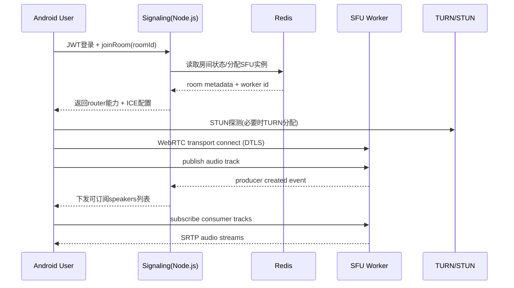

# ARCHITECTURE.md v0.2 - Android(Kotlin WebRTC)+Node.js SFU
*更新：2026-03-25 | 状态：🟢review | Tokens: 0/2M*

CHANGELOG
- v0.0 -> v0.1：初始SFU架构设计，覆盖SLA 99%与100并发<300ms目标。
- v0.1 -> v0.2：补齐`REQ-001`架构专章，冻结认证链路、Refresh安全策略、会话存储、风控限流、可观测指标、联调前检查清单与发布门禁；同步对齐`PRD v0.4`当前状态。

## 1. 设计目标（与PRD对齐）
- 业务形态：仿Yalla多人语聊房（1个房间最多100并发在线，最多8人上麦发言）。
- 技术栈：Android 原生 Kotlin + WebRTC；Node.js（Socket.io + SFU）；PostgreSQL。
- SLA：月度可用性 >= 99.0%（信令与音频房间核心链路）。
- 实时性：端到端语音延迟 P95 < 300ms（100并发场景）。
- 可扩展：支持水平扩容，单点故障可恢复，掉线可重连。

## 2. 架构决策
- 采用 SFU（Selective Forwarding Unit）而非 MCU：减少转码开销，控制端到端延迟。
- Node.js 统一承载业务 API + Signaling + SFU Worker 编排（建议基于 mediasoup）。
- Socket.io 负责信令（鉴权、入房、上麦、订阅、重连协调），媒体走 WebRTC DTLS/SRTP。
- TURN/STUN（coturn）用于 NAT 穿透兜底，弱网环境优先走 TURN/UDP。
- Redis 用于房间状态广播与多实例会话同步；PostgreSQL 持久化用户、房间、订单等业务数据。

## 3. 模块拆分
| 模块 | 职责 | 横向扩展 | 关键指标 |
|---|---|---|---|
| Android App (Kotlin) | 登录、入房、麦位管理、WebRTC 发布/订阅、弱网自适应 | 客户端发布 | join_success_rate, reconnect_success |
| API/Signaling Gateway (Node.js + Socket.io) | JWT鉴权、房间路由、SDP/ICE信令、重连会话恢复 | 多实例 + LB + Redis Adapter | signaling_rtt_p95, auth_fail_rate |
| SFU Cluster (Node.js Worker) | 音频流转发、活跃说话人检测、订阅控制 | 按房间分片扩容 | e2e_latency_p95, packet_loss, cpu |
| TURN/STUN (coturn) | NAT穿透与中继 | 多节点 | turn_allocations, relay_ratio |
| Redis | 房间元数据/事件总线/分布式会话锁 | 主从 + 哨兵/托管版 | redis_latency, failover_time |
| PostgreSQL | 用户、房间、订单、审计日志 | 读写分离（后续） | qps, slow_query, replication_lag |

## 4. 总体拓扑图（Mermaid）
```mermaid
flowchart LR
    A["Android Clients (1..100)"] -->|HTTPS/JWT| B["API + Signaling Gateway (Node.js)"]
    A -->|WebRTC SDP/ICE| B
    A -->|SRTP Audio (Pub/Sub)| C["SFU Cluster (Node.js/mediasoup)"]
    B --> D["Redis (Room State + PubSub)"]
    B --> E["PostgreSQL (User/Room/Order)"]
    B --> F["Load Balancer"]
    F --> B
    A --> G["STUN/TURN (coturn)"]
    G --> C
    C --> D
```

## 5. 关键时序（入房+开麦）


## 6. 延迟预算（P95）
| 链路环节 | 预算 |
|---|---|
| 采集+编码（客户端） | 35ms |
| 上行网络（Client->SFU） | 70ms |
| SFU排队+转发 | 25ms |
| 下行网络（SFU->Client） | 90ms |
| 抖动缓冲+解码+播放 | 60ms |
| **总计** | **280ms** |

说明：预算总量 280ms，为 300ms 目标预留约 20ms 波动空间。

## 7. 高可用与SLA 99%
- LB + 多实例 Gateway：任一网关故障不影响全局服务，健康检查秒级摘除。
- SFU 分片部署：房间固定到 SFU Worker，异常时触发房间级重建与客户端自动重连。
- Redis 保障跨实例会话同步：避免“信令实例切换导致房间状态丢失”。
- 客户端自动恢复：断线后指数退避重连（1s/2s/4s），保留房间上下文与麦位意图。
- 错峰发布：灰度10% -> 50% -> 100%，失败可快速回滚。

## 8. 容量与性能基线（MVP）
- 100并发语聊房基线：8上麦 + 92听众。
- 默认音频编码：Opus 24-32kbps，20ms ptime，开启 DTX/FEC（弱网优先抗丢包）。
- 下行策略：默认订阅8麦位；网络劣化时降级为“活跃说话人优先（4路）”。
- 目标资源（单房间）：SFU 出口带宽建议预留 40Mbps，CPU 保持 < 65%。

## 9. 可观测性与告警
- 实时指标：room_online, speaking_users, e2e_latency_p95, jitter, packet_loss, turn_ratio。
- SLA指标：monthly_uptime, join_success_rate, reconnect_success_rate。
- 告警阈值：
  - e2e_latency_p95 > 300ms 持续 5 分钟 -> P1 告警。
  - join_success_rate < 98% 持续 10 分钟 -> P1 告警。
  - SFU CPU > 80% 持续 5 分钟 -> 自动扩容 + P2 告警。

## 10. 安全与合规（MVP最小闭环）
- API 鉴权：JWT + 短时 access token，refresh token 分离。
- 媒体链路：DTLS-SRTP 强制加密，禁止明文 RTP。
- 风控：入房频控、IP/设备维度限流、防刷礼物接口签名校验。
- 审计：关键事件（登录、入房、上麦、送礼）落库可追踪。

## 11. REQ-001 架构专章（登录 / 钱包开通）

### 11.1 当前状态与交付目标
- 与`/Users/yuanye/myWork/ChatRoom/docs/00-ENTRANCE/PROJECT_OVERVIEW.md`、`/Users/yuanye/myWork/ChatRoom/docs/01-PRODUCT/PRD.md`对齐，`REQ-001`当前状态仍为`🟡draft`，原因是`OTP回退口令`、`Refresh Token明文存储`、`接口路径偏差`三项P0阻塞尚未在主线程复审清零。
- 架构侧本轮目标是把`REQ-001`补到“可执行联调”状态，而不是提前宣告业务通过；具体指：
  - 认证链路、状态机、失败分支、错误码与数据边界冻结；
  - `feature_dev`有明确的实现落点与存储模型；
  - `test_writer`有可执行的检查清单、观测指标与证据模板；
  - 发布门禁能够在灰度前阻断不安全实现。

### 11.2 认证链路（冻结方案）
- 规范路径只保留`/api/v1/auth/otp/send`、`/api/v1/auth/otp/verify`、`/api/v1/auth/refresh`三条主入口；`/api/auth/*`与`/api/v1/auth/login/otp`视为legacy路径，统一返回`404`或`410`并打观测点。
- 登录链路按“先风控、再OTP、后开户、最后签发会话”执行，OTP provider异常必须`fail-closed`，不得回退到静态口令或测试后门。
- 首登开户与风控初始化必须和会话创建共享同一数据库事务，防止出现“token已签发但钱包未开”的半成功状态。
- Android端只在本地安全存储中保留`refresh token`，`access token`仅驻留内存并在失效后通过刷新换发。

```mermaid
sequenceDiagram
    participant C as Android Client
    participant G as API Gateway
    participant RK as Risk Engine
    participant OTP as OTP Provider
    participant PG as PostgreSQL
    participant RD as Redis

    C->>G: POST /api/v1/auth/otp/send(phone, device_id, install_id)
    G->>RK: preCheck(phone, ip, device_id)
    alt 命中限流/黑名单
        RK-->>G: reject(AUTH_003 / RISK_002 / RISK_003)
        G-->>C: 429/403 + request_id
    else 通过预检
        G->>OTP: sendOtp(phone, request_id)
        alt OTP服务异常
            OTP-->>G: unavailable
            G-->>C: 503 AUTH_005 (fail-closed)
        else 发送成功
            OTP-->>G: otp_ticket + expire_at
            G-->>C: 200 otp_ticket + resend_after_sec
            C->>G: POST /api/v1/auth/otp/verify(otp_ticket, otp_code, device_id)
            G->>RK: verifyContext(phone, ip, device_id)
            G->>OTP: verifyOtp(otp_ticket, otp_code)
            alt OTP错误/过期
                OTP-->>G: invalid
                G-->>C: 400 AUTH_002
            else OTP校验通过
                G->>PG: tx(upsert user + bootstrap wallet + init risk + insert refresh_session_hash)
                G->>RD: write session cache + revoke index TTL
                G-->>C: 200 access_token + refresh_token + session_id + wallet_summary
                Note over C,G: access_token TTL=2h; refresh_token TTL=30d
                C->>G: POST /api/v1/auth/refresh(refresh_token, session_id)
                G->>PG: select refresh_session for update by hash
                alt 会话有效且未重放
                    G->>PG: revoke old session + insert rotated session
                    G->>RD: publish revoke(old_jti), cache(new_jti)
                    G-->>C: 200 new_access_token + new_refresh_token
                else 会话失效/被重放
                    G-->>C: 401 AUTH_001 / 409 AUTH_004
                end
            end
        end
    end
```

### 11.3 Token / Refresh 安全策略
| 项目 | 冻结策略 | 联调判定 |
|---|---|---|
| Access Token | TTL `2小时`；服务端统一签名算法与`kid`版本标识；禁止`alg=none`与匿名token | 篡改/过期后统一返回`AUTH_001` |
| Refresh Token | TTL `30天`；每次刷新必须轮转；客户端一次只持有最新refresh token | 刷新成功后旧token立即作废，传播窗口`<=60s` |
| Refresh存储 | 服务端只落`refresh_token_hash`，推荐`SHA-256(token + server_pepper)`；禁止日志、埋点、异常栈输出明文token | 数据库、缓存、日志抽检均不可见明文token |
| 会话绑定 | 绑定`session_id + user_id + device_id + install_id + ip_hash + ua_hash` | 设备漂移或IP异常时进入风控或强制重登 |
| 重放防护 | 刷新时对旧会话行加锁，事务内完成“旧会话吊销 + 新会话落库”；重复使用旧refresh token记为重放事件 | 返回`AUTH_004`并打`refresh_reuse_detected_total` |
| 客户端存储 | `refresh token`进入Android Keystore/EncryptedSharedPreferences；`access token`只驻留内存；登出时本地安全清除 | 抓包/日志/崩溃报告不得泄漏token |

### 11.4 会话存储与一致性边界
| 存储层 | Key / 表 | 作用 | 失效策略 |
|---|---|---|---|
| PostgreSQL | `auth_refresh_session` | 刷新会话主表，字段至少包含`session_id`、`user_id`、`refresh_token_hash`、`status`、`device_id`、`install_id`、`ip_hash`、`ua_hash`、`issued_at`、`expires_at`、`rotated_from`、`rotated_to`、`revoked_at`、`last_seen_at` | 权威数据源；过期/吊销后保留审计记录 |
| PostgreSQL | `user_wallet` + `user_risk_profile` | 首登开户、余额初始化、风险等级初始化 | 与用户创建、refresh会话插入同事务提交 |
| Redis | `auth:session:{session_id}` | 热路径缓存`uid/jti/status/expires_at`，服务于鉴权与登出传播 | TTL不长于access token；失配时回源PG |
| Redis | `auth:revoke:{jti}` | 旧refresh/access令牌吊销索引 | TTL覆盖剩余有效期，防止旧token在传播窗口内被误用 |
| Redis | `rate_limit:*` | 手机号/IP/设备维度频控计数器 | 依据限流窗口自动过期 |

- 会话状态机冻结为：`ACTIVE -> ROTATED -> REVOKED / EXPIRED`；任何非`ACTIVE`状态都不能继续刷新。
- 鉴权读取顺序：优先校验签名与TTL，再查`Redis revoke index`，最后必要时回源PG做会话状态确认。
- 首登事务边界冻结为：`user upsert -> wallet bootstrap -> risk profile init -> refresh session insert -> commit -> issue tokens`；任一步失败都不能向客户端返回成功。

### 11.5 风控与限流基线
| 场景 | 限流维度 | 基线 | 超限动作 |
|---|---|---|---|
| OTP发送 | `phone` | `1次/60秒`, `5次/10分钟` | 返回`AUTH_003`，提示冷却 |
| OTP发送 | `ip` / `device_id` | `20次/10分钟`, `10次/10分钟` | 返回`AUTH_003`并记录可疑源 |
| OTP校验 | `phone + device_id` | `5次/10分钟` | 返回`AUTH_002`；连续失败`>=3`次进入10分钟冷却 |
| Refresh | `session_id` | `10次/分钟` | 返回`AUTH_004`并标记可疑重放 |
| 登录成功后入房准备 | `uid` | `5次/分钟`拉取钱包、`10次/分钟`请求join token | 返回`429`，避免脚本刷接口 |

- 风控判定顺序：`黑名单` > `设备/IP聚类异常` > `基础频控` > `正常放行`。
- MVP阶段不引入复杂验证码升级流；一旦命中高危规则，直接阻断并产生日志、审计与客服申诉入口。
- `gift.send`链路继续沿用`REQ-002`风控规则，但必须依赖`REQ-001`提供的稳定`uid/session/device`身份底座。

### 11.6 REQ-001 可观测指标
| 类别 | 指标 | 目标 / 告警阈值 | 用途 |
|---|---|---|---|
| 成功率 | `auth_login_success_rate` | `<99%`持续15分钟触发P1 | 对齐PRD登录成功率门槛 |
| 成功率 | `wallet_open_success_rate` | `<99.9%`持续15分钟触发P1 | 监控首登开户原子性 |
| 延迟 | `auth_verify_latency_p95` | `>800ms`持续10分钟触发P2 | 观察OTP+开户链路是否拖慢联调 |
| 刷新安全 | `auth_refresh_success_rate` | `<98%`持续15分钟触发P1 | 识别轮转异常或Redis/PG抖动 |
| 刷新安全 | `refresh_reuse_detected_total` | 5分钟内突增触发P1 | 发现旧token重放、客户端缓存错乱 |
| 路径一致性 | `legacy_auth_path_hit_total` | 灰度后非0即触发P2 | 识别客户端或脚本仍在调用旧路径 |
| 风控 | `auth_rate_limit_block_total`、`auth_risk_block_total` | 与历史基线偏离`>30%`触发分析 | 区分真实攻击与误杀 |

- 结构化日志字段至少包含：`request_id`、`trace_id`、`uid`、`session_id`、`device_id`、`ip_hash`、`route`、`result_code`、`latency_ms`。
- 链路追踪最少覆盖：`otp_send`、`otp_verify`、`wallet_bootstrap`、`refresh_rotate`四段span。
- 灰度观测看板必须能同时展示“请求成功率 + 错误码分布 + 风控拦截 + legacy路径命中 + 钱包开户成功率”。

### 11.7 联调前检查清单
#### A. 环境与配置
- Base URL统一为`/api/v1`，Android、Postman、自动化脚本都已切到规范路径。
- OTP provider使用同一套联调配置；若使用sandbox，需明确号码白名单与验证码获取方式。
- 服务端已注入签名密钥、`server_pepper`、Redis、PostgreSQL连接，且节点时钟偏差`<5s`。
- 日志脱敏开关开启，确认不会打印手机号全量、OTP明文、refresh token明文。

#### B. 实现与数据
- `auth_refresh_session`表与必要索引已存在，支持按`refresh_token_hash`和`session_id`查询。
- 首登事务已覆盖“用户开户 + 风控初始化 + 会话插入”；失败时不会留下半成功钱包或会话。
- legacy路径已显式拒绝，并写入`legacy_auth_path_hit_total`。
- Android端已采用安全存储保存refresh token，access token不落盘。

#### C. 联调用例
- 正常流：`otp/send -> otp/verify -> wallet/summary -> auth/refresh -> join-token -> gift链路预检`。
- 异常流：错误OTP、过期OTP、OTP provider不可用、篡改access token、过期access token、重放旧refresh token。
- 回归流：legacy路径调用必须失败；首登重复请求不重复开户；刷新后旧refresh token不可再用。
- 指标流：每个场景至少保留1组`request_id + trace_id + 关键日志检索词 + 指标截面`。

### 11.8 验收证据模板（供 feature_dev / test_writer 复用）
```md
## REQ-001 联调验收证据
- 验证时间：
- 验证环境：
- 构建版本 / 提交：
- 验证角色：
- 关联需求：REQ-001

### 1. 场景结果
| 场景ID | 场景描述 | 输入摘要 | 预期结果 | 实际结果 | request_id / trace_id | 证据位置 | 结论 |
|--------|----------|----------|----------|----------|------------------------|----------|------|
| AUTH-01 | OTP发送成功 | phone/device_id | 200 + otp_ticket |  |  |  |  |
| AUTH-02 | OTP错误拒绝 | wrong otp | AUTH_002 |  |  |  |  |
| AUTH-03 | OTP服务异常fail-closed | provider down | 503 AUTH_005 |  |  |  |  |
| AUTH-04 | 首登开户成功 | first login | user + wallet + risk init完成 |  |  |  |  |
| AUTH-05 | Refresh轮转成功 | current refresh token | 返回新token，旧token失效 |  |  |  |  |
| AUTH-06 | 旧Refresh重放拒绝 | rotated old token | AUTH_004 |  |  |  |  |
| AUTH-07 | Legacy路径回归 | /api/v1/auth/login/otp | 404/410 |  |  |  |  |

### 2. 指标截面
- auth_login_success_rate：
- wallet_open_success_rate：
- auth_refresh_success_rate：
- refresh_reuse_detected_total：
- legacy_auth_path_hit_total：

### 3. 日志与追踪
- 关键日志检索词：
- 关键trace/span：
- 是否发现敏感信息泄漏（手机号/OTP/token）：

### 4. 风险与结论
- 未决问题：
- 是否满足发布门禁：
- reviewer：
```

### 11.9 发布门禁（灰度前必须全部满足）
- `OTP回退口令`、测试后门、默认验证码已从代码与配置中移除，且OTP provider异常时统一`fail-closed`。
- 认证主路径完全收敛到`/api/v1/auth/*`；legacy路径不再对外提供成功响应。
- 服务端只存`refresh_token_hash`，数据库、缓存、日志、监控样本均不可见明文refresh token。
- 首登开户、风险初始化、会话插入具备事务原子性；`wallet_open_success_rate >= 99.9%`。
- `auth_login_success_rate >= 99%`、篡改/过期token拒绝率`=100%`、旧refresh token轮转失效传播`<=60s`。
- 联调证据模板已填充完成，至少覆盖正常流、异常流、重放流、legacy回归流，并由`test_writer`复审。

## 12. 需求映射
- REQ-001 登录JWT -> API Gateway + PostgreSQL + Redis 会话。
- REQ-002 创建/加入房间 -> Signaling + SFU 房间分配。
- REQ-003 群聊音频（8麦） -> SFU Producer/Consumer 与客户端订阅策略。
- REQ-004 退出/掉线重连 -> 客户端重连状态机 + 信令会话恢复。

## 13. 里程碑建议
- M1（2天）：打通单房间入房、上麦、听众收听链路（20并发）。
- M2（2天）：实现重连恢复、弱网降级、关键指标打点。
- M3（1天）：压测至100并发，验证P95<300ms并输出报告。
